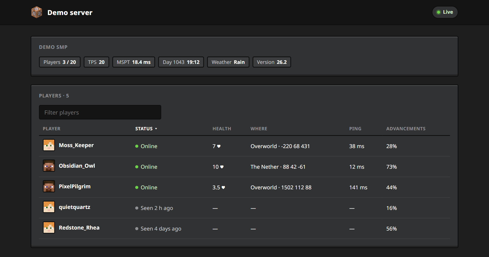
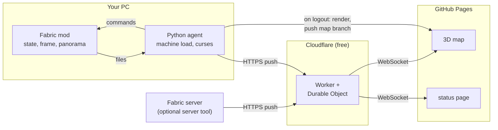

<h1 align="center">mc-status</h1>

<p align="center">
  <b>A live, invite-only window into your Minecraft sessions.</b><br>
  Vitals, inventory, advancements, stats and your PC's load while you play.<br>
  A 360° view and a 3D map of where you left once you log out.
</p>

<p align="center">
  <a href="https://github.com/nyannoying1337/mc-status/actions/workflows/tests.yml"></a>
  
  
  
  <a href="LICENSE"></a>
</p>

<p align="center">
  
</p>

<p align="center">
  <a href="#what-it-shows">What it shows</a> ·
  <a href="#get-your-own">Get your own</a> ·
  <a href="#server-tool">Server tool</a> ·
  <a href="#documentation">Docs</a>
</p>

---

## Why

- **It looks like the game.** Hearts, hunger, XP, the inventory screen, advancement frames and toasts are drawn with Minecraft's own sprites, pixel-exact at any display scaling.
- **It's live without polling.** Viewers keep one WebSocket open and every update is pushed to them, so a tab left open all day costs about as much as one page load.
- **It costs nothing.** GitHub Pages and Cloudflare's free plan. Past a limit, requests just fail until midnight UTC; nothing is ever billed.
- **Nothing reaches into your PC.** The agent only pushes out, so it works behind any router or captive portal.
- **It's private by default.** Invite key only, at most 10 viewers at once, and every published field is on an explicit allowlist.

## What it shows

### While you play

The newest HUD-free frame of your world, with your vitals where the game draws them and the toast for an advancement you just earned. Chat never appears in it, because the frame is taken before the HUD is drawn.

<table>
  <tr>
    <td width="50%"></td>
    <td width="50%"><br></td>
  </tr>
  <tr>
    <td><b>Inventory</b> on the real inventory screen, with enchantment glint, durability and tooltips.</td>
    <td><b>World</b>: day, time, weather, biome, difficulty. <b>Play time</b> for each of the last 7 days.</td>
  </tr>
</table>

### Your progress

<table>
  <tr>
    <td width="50%"></td>
    <td width="50%"></td>
  </tr>
  <tr>
    <td><b>Advancement checklists.</b> Adventuring Time, Monsters Hunted, A Balanced Diet, Two by Two and every other "collect them all" advancement, split into done and still to do. Works for datapack advancements too.</td>
    <td><b>The game.</b> FPS, tick time and the game's memory as live meters, plus entities, loaded chunks, render distance — and the machine's load underneath.</td>
  </tr>
</table>

<p align="center"></p>

Also: advancement progress per tab, recently earned and almost done; statistics and favourites (most mined, most crafted, most hunted, and what killed you most).

### After you log out

<p align="center"></p>

- **A 360° view** of where you left, which visitors can drag around. The mod renders it while the pause menu is open, so you never see it happen.
- **A 3D map** of the area around your logout (BlueMap), marked with where you were last seen and where you last died.
- **What you logged out with**, and your stats as of that session.

### On someone else's server

Only that you're playing, your vitals and your inventory. No coordinates, frames, map markers or curses, and the server's address is never written anywhere.

### Cursed mode (optional)

The machine reaches into your world: a hot GPU sets the ground on fire, low RAM makes you slow, 12 hours of uptime tells you to go to bed. Plain commands with conditions and cooldowns, off by default. [How it works →](docs/features.md#cursed-mode)

Every card also works on a phone. **[Full tour of the page →](docs/features.md)**

## Get your own

About 15 minutes, all on free plans. You need a GitHub account, a Cloudflare account, Python 3.11+, Node.js 20+, and Minecraft Java with Fabric.

```bash
# 1. press "Use this template" on GitHub, then clone what it made:
git clone https://github.com/<you>/<your-repo>.git
cd <your-repo>

# 2. the wizard deploys the Worker, creates the keys, installs the agent and prints your invite link
python setup.py
```

Then set two repository variables, turn on GitHub Pages and push. **[Full setup guide →](docs/setup.md)**

## Server tool

The same mod jar, dropped into a Fabric server, publishes every player on it: a moderation view for you, and a page of their own for each player.

<p align="center"></p>

- **Admin page:** the server's TPS and tick time, and every player online or offline, with health, position, ping and advancement progress. Open anyone for their inventory, statistics and checklists.
- **Actions and console:** with a separate control key, heal, feed, change game mode, message, kick, ban and whitelist players, or run any command and see the output. Every action is logged.
- **Player links:** a link that shows one player only their own page.
- **In game:** `/mcstatus admin` sends an op a clickable admin link, `/mcstatus control` the one that can act; `/mcstatus link` sends a player theirs.

Optional, and inactive until you run `python setup.py server`. **[Server tool guide →](docs/server-tool.md)**

## How it works



**[Architecture →](docs/architecture.md)**

## Documentation

| Guide | What's in it |
| --- | --- |
| [Setup](docs/setup.md) | Fork and deploy, your own domain, installing by hand, updating, troubleshooting |
| [Features](docs/features.md) | Every card on the page, the logout panorama and map, multiplayer, cursed mode |
| [Server tool](docs/server-tool.md) | Admin page, player links, `/mcstatus` commands, setup on a server |
| [Configuration](docs/configuration.md) | `agent/config.toml`, the mod's settings, secrets and repository variables |
| [Privacy and security](docs/privacy.md) | What's published and what never is, who can watch, staying on free tiers |
| [Architecture](docs/architecture.md) | How the mod, agent, Worker, page and map fit together |
| [Development](docs/development.md) | Tests, running locally, releasing, updating to a new Minecraft version |

## License

MIT, see [LICENSE](LICENSE).

NOT AN OFFICIAL MINECRAFT PRODUCT. NOT APPROVED BY OR ASSOCIATED WITH MOJANG OR MICROSOFT. Minecraft is a trademark of Mojang. The screenshots in this README show made-up demo data.
