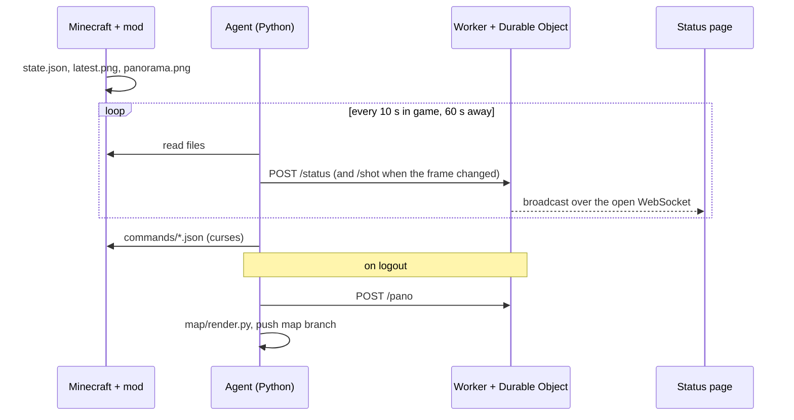

# Architecture

[← README](../README.md) · [Setup](setup.md) · [Features](features.md) · [Server tool](server-tool.md) · [Configuration](configuration.md) · [Privacy](privacy.md) · **Architecture** · [Development](development.md)

- [Overview](#overview)
- [Repository layout](#repository-layout)
- [The mod](#the-mod)
- [The agent](#the-agent)
- [The Worker](#the-worker)
- [The page](#the-page)
- [The map](#the-map)
- [The server tool](#the-server-tool)
- [Workflows](#workflows)

## Overview

- **Push only.** The PC makes outgoing HTTPS requests; nothing connects to it.
- **One source of truth.** The Worker keeps only the latest status, frame and panorama.
- **Broadcast, not polling.** Each viewer holds one WebSocket; pushes fan out to all of them for free.

## Repository layout

| Path | What it is |
| --- | --- |
| `mod/` | Fabric mod, one jar for client and server. `src/client` (singleplayer capture), `src/main/java/mcstatus/common` (snapshots shared by both), `src/main/java/mcstatus/server` (server tool) |
| `agent/` | Python agent: `agent.py` (main loop), `collect.py` (mod or RCON, allowlist), `presence.py` (online/offline, logout render), `media.py` (frame, panorama), `sysinfo.py`, `playtime.py`, `cursed.py`, `upload.py` |
| `worker/` | Cloudflare Worker: `worker.js` (status page routes, `StatusStore`), `server.js` (server tool, `ServerStore`) |
| `site/` | Static page, no build step: `index.html`, `server.html`, `style.css`, `js/*.js`, `build_assets.py` |
| `map/` | `render.py` (BlueMap render and publish), `live-feed.js`, `site-chrome.js`, `ore-ui.css` |
| `setup.py` | Setup wizard and maintenance commands |
| `tests/` | Agent, curse and Worker tests; no Minecraft or Cloudflare needed |
| `docs/` | These guides |

## The mod

Fabric, Mojang mappings, Java 25. Everything it shares goes through files in `.minecraft/mc-status/`.

| File | Contents | Written |
| --- | --- | --- |
| `state.json` | vitals, every inventory slot (durability, enchantments), position, FPS and game memory; in singleplayer also world facts, statistics, advancements with checklists, last death | when something changes, at least every 5 s; `online: false` on logout |
| `latest.png` | HUD-free frame | every 60 s and when the pause menu opens |
| `panorama.png`, `panorama.json` | six 1024² faces in one 6144×1024 strip, and when it was taken | as the pause menu opens in singleplayer, at most every 2 min |
| `commands/*.json` | curses to run, written by the agent | the mod runs and deletes them; older than a minute is dropped; ignored on servers |

Files are written to a temp file and swapped into place, retried while the agent has them open (Windows sharing violations).

**Statistics and advancements** are read on the integrated server's thread every 10 seconds. An advancement counts as a checklist when every requirement is a single criterion and there are at least two, so datapacks work without a list.

### Why capturing doesn't lag

The game's own screenshot code reads the whole frame back and loops over every pixel on the render thread. On integrated graphics that froze the game for about 600 ms.

The mod (`GpuReadback`) instead:
1. blits the frame into a smaller texture on the GPU;
2. copies it into a mapped buffer asynchronously;
3. copies the bytes out and encodes the PNG on a background thread.

About 1 ms is spent on the render thread. The panorama follows vanilla's panoramic screenshot code: the camera switches to panoramic mode, six faces are rendered into their own targets at 1024², and each is read back the same way. It runs only while the game is paused, so the extra renders are never seen.

## The agent

A loop that runs every 10 seconds while you play and every 60 seconds otherwise.

1. **Collect** the player from the mod's `state.json` (or RCON), keeping only allowlisted keys and dropping singleplayer-only keys on servers.
2. **Add** machine load (psutil; GPU from Windows performance counters; temperatures from fastfetch every 5 minutes), play time and recent curses.
3. **Push** `POST /status`, plus `POST /shot` when the frame changed (re-encoded as JPEG, at most 1920 wide).
4. **Curses:** evaluate rules and write `commands/*.json` for the mod (or send over RCON).
5. **On logout:** upload the panorama if it belongs to this logout (taken within 10 minutes of it), then run `map/render.py` if enabled.

It runs at login via a Windows scheduled task, a launchd agent or a systemd user service (`setup.py autostart`).

## The Worker

One Worker with two SQLite-backed Durable Objects: `StatusStore` for the status page and `ServerStore` for the server tool.

### Routes

| Route | Auth | What it does |
| --- | --- | --- |
| `POST /status` | `PUSH_TOKEN` | store the latest status, broadcast it |
| `POST /shot` | `PUSH_TOKEN` | store the frame, broadcast it as a binary message |
| `POST /pano` | `PUSH_TOKEN` | store the panorama (not broadcast) |
| `GET /live` | `VIEW_KEY` | WebSocket: latest status and frame, then every push |
| `GET /status`, `GET /shot` | `VIEW_KEY` | fallback for networks that block WebSockets |
| `GET /pano?t=…` | `VIEW_KEY` | the panorama, cached as immutable per timestamp |
| `GET /bluemap/<map>/live/players.json` | `VIEW_KEY` | map markers fallback |
| `GET /server/connect` | `SERVER_PUSH_TOKEN` | the server's own WebSocket: status up, actions down |
| `POST /server/status` | `SERVER_PUSH_TOKEN` | server tool push over HTTPS, when the socket is down |
| `GET /server/live` | control key, admin key or player link | server tool WebSocket, filtered per viewer; control viewers send actions up it |
| `POST /server/links` | `SERVER_PUSH_TOKEN` | the control key, admin key or a player link, for `/mcstatus` |
| `GET /server/link` | admin key | a player link, for the admin page's "Copy player link" |

### Details

- **Hibernating WebSockets.** Viewers' sockets are held by the Durable Object with the hibernation API; keep-alive pings are answered by the runtime without waking it.
- **Key changes close old sockets.** Each socket remembers a hash of the key it joined with; on the next broadcast, sockets with an outdated hash are closed with code 4001.
- **Refused early.** Wrong keys are refused in the Worker before the Durable Object is touched. A full page (10 viewers) closes with 4003.
- **Stale detection.** Every status message carries `stale_ms` (90 s); the page uses it to say the machine went quiet.
- **Images** are limited to just under 2 MB, the Durable Object value limit.

## The page

Plain HTML, CSS and ES modules served by GitHub Pages; no framework and no build step.

| Module | Role |
| --- | --- |
| `js/main.js` | The live view, built from sections that are only rebuilt when their inputs change, so tooltips, animations and the panorama stay steady between pushes |
| `js/live.js` | WebSocket, invite key, polling fallback, hidden-tab disconnect |
| `js/cards.js` | Every card: advancements and checklists, statistics, world, machine, play time, map, curses |
| `js/gui.js` | Game GUIs (inventory, vitals, toast, tooltips) drawn from sprites at whole-pixel scales, so they stay sharp at any display scaling |
| `js/panorama.js` | The 360° view: a CSS 3D cube with drag, touch and keyboard control |
| `js/assets.js` | Icon, font and name lookups built at deploy time |
| `js/server.js` | The server tool page |
| `js/config.js` | Worker URL and site name, rewritten at deploy from repository variables |

**Assets.** `site/build_assets.py` runs in the Deploy site workflow: it downloads the Minecraft client jar from Mojang (checksum-verified) and renders item icons, HUD sprites, the font and English names into the gitignored `site/assets/mc/`. Font glyphs are pre-tinted images, because CSS masks blur pixel art.

## The map

1. **Render.** `map/render.py` downloads BlueMap's CLI, renders the chosen area of the world (default: 8 chunks around your logout), and installs the page's additions into the webapp.
2. **Publish.** The render is force-pushed to the `map` branch as a single commit, so the repository never grows. The Deploy site workflow combines `main`'s page with the `map` branch into one Pages site.
3. **Live markers.** `map/live-feed.js` turns off BlueMap's once-a-second marker polling and feeds the player marker and death marker from the page's WebSocket instead. It relies on BlueMap internals: check the markers after bumping `BLUEMAP_VERSION`.
4. **Chrome.** `map/site-chrome.js` and `ore-ui.css` add the way back to the status page, the disclaimer and the page's look.

## The server tool

- **The mod** has a server entrypoint (`McStatusServer`). Every `interval_seconds` on the server thread it snapshots the server (TPS, tick time, day, weather) and each online player (vitals, ping, position, inventory, statistics, advancements), using the same `Snapshots` code as the client. Offline players are read from the world's `players/stats` and `players/advancements` files every 5 minutes. The JSON is sent off the server thread.
- **The server link.** `ServerLink` keeps a WebSocket open to `/server/connect` (reconnecting with backoff). Status goes up it, falling back to `POST /server/status` while it's down.
- **The Worker's `ServerStore`** keeps one row per player and rewrites only rows that changed; the overview row at most once a minute. Each viewer socket carries its role (control, admin, or player with a UUID), and every broadcast is filtered per socket.
- **Actions.** A control viewer sends `{type: "action", …}` up its socket. `checkAction` in `worker/server.js` allows only known actions with a valid UUID and bounded text, at most 30 a minute; the checked action goes down the server link, and an entry is added to the action log (`server:log`, last 50). `ServerActions` in the mod checks again, runs it on the server thread (vanilla commands as a "Web admin" source, collecting their output), and sends a result that completes the log entry.
- **Player links** are `<uuid>.<HMAC-SHA256(PLAYER_LINK_SECRET, "player:" + uuid)>`, verified by recomputing; nothing is stored.
- **`/mcstatus` commands** are Brigadier commands; the server fetches keys from `POST /server/links` with its token and sends a clickable link to the command's source only.

## Workflows

| Workflow | Runs on | Does |
| --- | --- | --- |
| Deploy site | push to `main`, `map`, `shots` or `demo` | builds assets, writes `config.js`, publishes the page with the map, frame archive and demo imagery to Pages |
| Tests | push to `main`, pull requests | agent, curse, Worker and server tool tests; setup wizard dry run |
| Build mod | changes under `mod/` | builds the jar |
| Release mod | tags `v*`, or Run workflow | builds the jar and attaches it to a GitHub release, tagging `mod/gradle.properties`'s version when run by hand |
| Deploy Worker | changes under `worker/` | deploys the Worker and syncs secrets, if Cloudflare secrets are set |
