# Features

[← README](../README.md) · [Setup](setup.md) · **Features** · [Server tool](server-tool.md) · [Configuration](configuration.md) · [Privacy](privacy.md) · [Architecture](architecture.md) · [Development](development.md)

A tour of the status page, card by card. Screenshots show made-up demo data.

- [The frame](#the-frame)
- [Inventory](#inventory)
- [Advancements and checklists](#advancements-and-checklists)
- [Statistics](#statistics)
- [World](#world)
- [The game](#the-game)
- [Mods](#mods)
- [Play time](#play-time)
- [After you log out](#after-you-log-out)
- [The 3D map](#the-3d-map)
- [Multiplayer](#multiplayer)
- [Cursed mode](#cursed-mode)
- [Who can watch](#who-can-watch)
- [What shows when](#what-shows-when)

## The frame

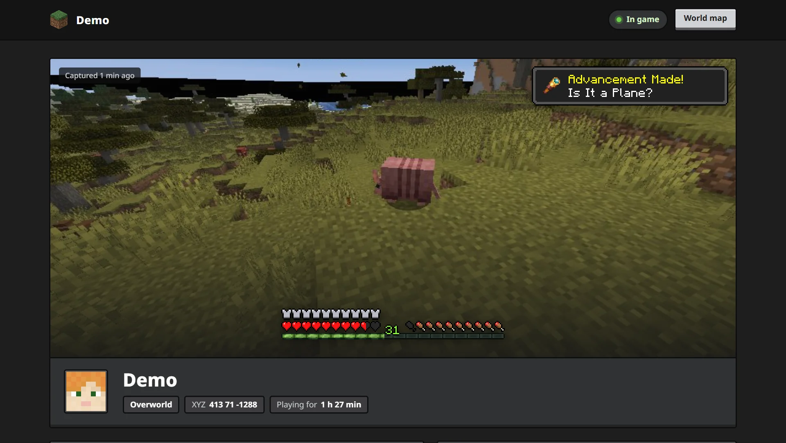

- **What:** a frame of your world, taken after the world is drawn but before the HUD, so chat, the hotbar and menus never appear.
- **When:** every 60 seconds while you play, and when the pause menu opens.
- **Vitals:** armor, hearts, hunger and the XP bar and level are drawn with the game's sprites at the bottom centre, where the game draws them.
- **Toast:** for 5 minutes after you earn an advancement, its toast sits in the top right, like in game.
- **No lag:** the frame is scaled down on the GPU and copied out on a background thread, so it costs about 1 ms of the render thread. See [Architecture](architecture.md#why-capturing-doesnt-lag).
- **Your identity:** skin, name, dimension, coordinates and how long you've been playing.

## Inventory

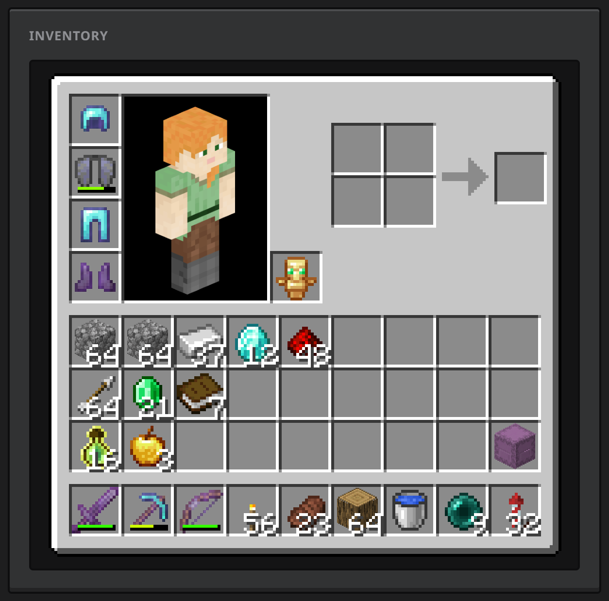

The real inventory screen: armor, offhand, main inventory and hotbar, with your skin in the preview.

- **Items** show stack counts, durability bars and the enchantment glint.
- **Tooltips** on hover (or tap) list the item's name, enchantments and durability.
- **Logged out,** the card becomes "Logged out with" and keeps what you had.
- **Custom item names** are only shown if you turn on `share_item_names` in the mod's settings, because they can contain anything.

## Advancements and checklists

<table>
  <tr>
    <td width="50%" valign="top">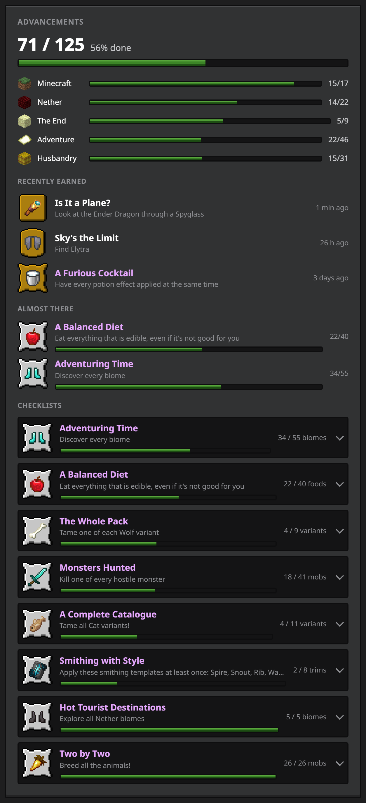</td>
    <td width="50%" valign="top">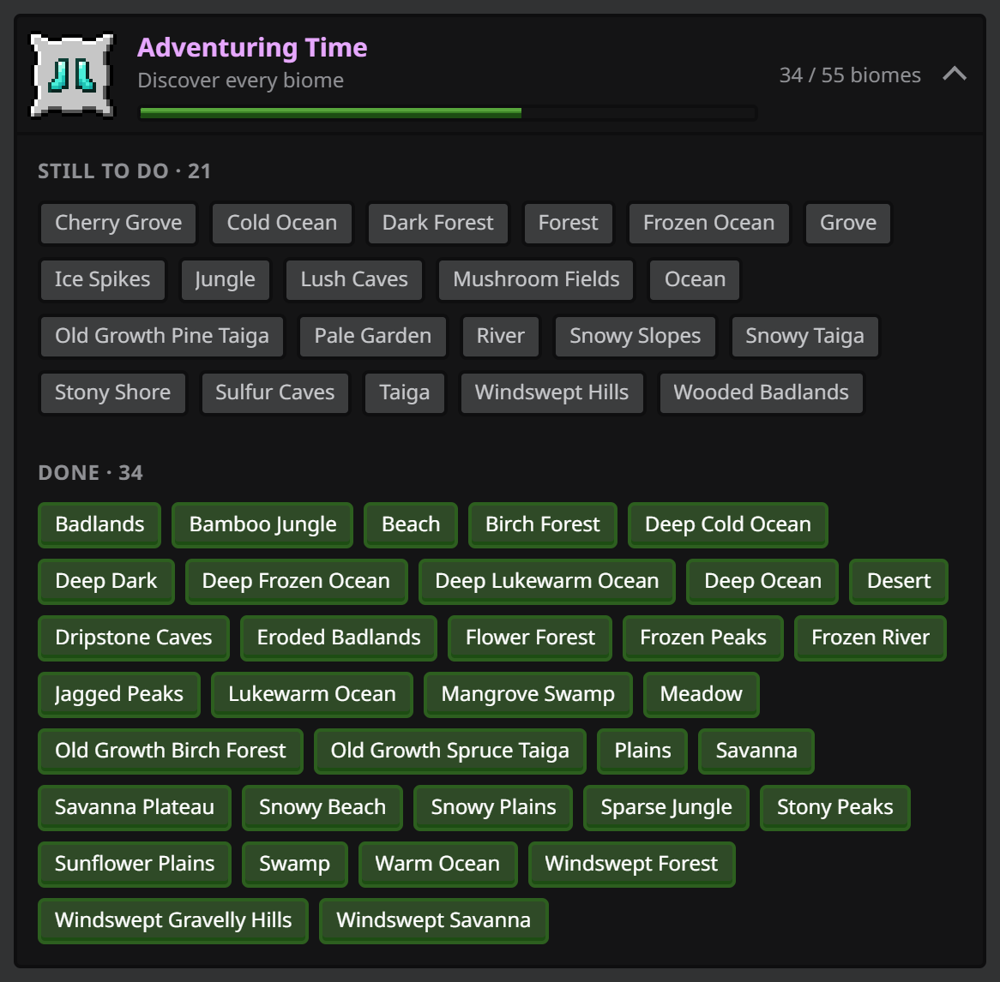</td>
  </tr>
</table>

- **Progress:** done out of total, and a bar per tab (Minecraft, Nether, The End, Adventure, Husbandry).
- **Recently earned:** the last few, with when.
- **Almost there:** the advancements you're closest to finishing.
- **Checklists:** every advancement that is a list of separate things to do. Click one to see what's still missing and what's done.

| Advancement | You collect |
| --- | --- |
| Adventuring Time | biomes |
| Hot Tourist Destinations | Nether biomes |
| Monsters Hunted | hostile mobs (with spawn egg icons) |
| Two by Two | animals bred |
| A Balanced Diet | foods (with item icons) |
| Smithing with Style | armor trim templates |
| A Complete Catalogue | cat variants |
| The Whole Pack | wolf variants |
| With Our Powers Combined! | frog variants |

Checklists are detected from the advancement's structure, not a fixed list, so datapack advancements built the same way show up too. Opened checklists stay open while the page updates.

## Statistics

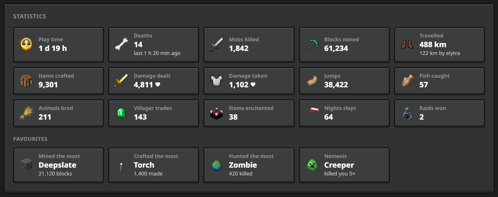

Play time, deaths and time since the last one, mobs killed, blocks mined, distance travelled (and how much of it by elytra), items crafted, damage dealt and taken, jumps, fish caught, animals bred, villager trades, items enchanted, nights slept and raids won.

**Favourites:** the block you mined most, the item you crafted most, the mob you hunted most, and your nemesis: the mob that killed you most.

Read from your world's statistics on the integrated server's thread every 10 seconds; singleplayer only.

## World

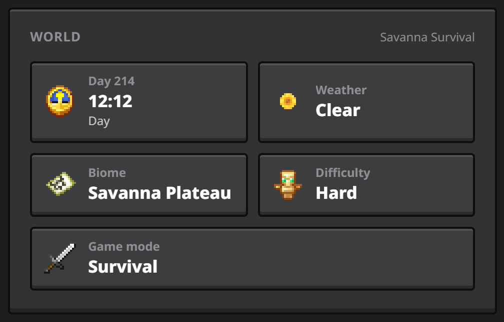

World name, day count and time, weather, biome, difficulty (or hardcore) and game mode. Only while you're in one of your own worlds.

## The game

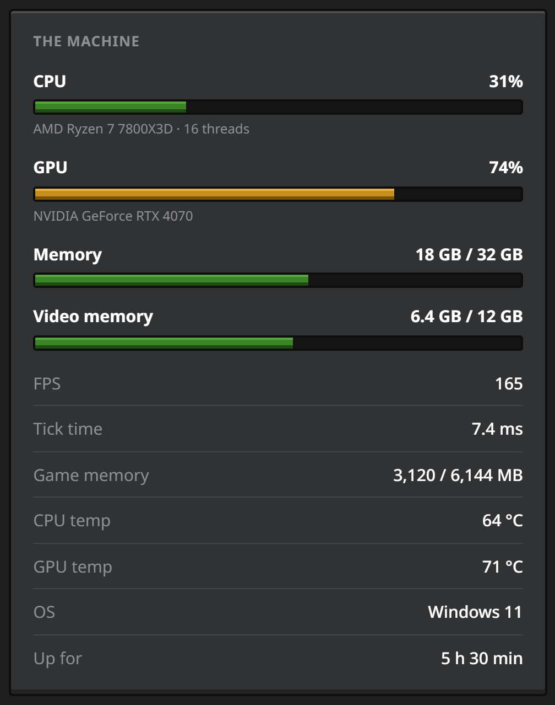

How the game is actually running, with the machine as a footnote.

- **FPS**, **tick time** and the **game's memory** as meters, while you play. Tick
  time is measured against the 50 ms a tick has to finish in; past that the world
  is falling behind, and the bar goes red. FPS reads the other way round — a full
  bar is the good outcome.
- **TPS**, under the tick time. Your own worlds only: on a server the tick rate
  is the server's to report, not the client's.
- **Entities** and **chunks** loaded, and your **render distance**.
- **The machine:** CPU and GPU load, OS and uptime, as plain rows.

CPU and GPU temperatures are still collected — [cursed mode](#cursed-mode) runs on
them — but they're no longer on the card. They need
[fastfetch](https://github.com/fastfetch-cli/fastfetch) installed, and are checked
every 5 minutes. GPU load on Windows comes from the system's performance counters,
so it works for any vendor.

## Mods

Every mod you have installed, with its version. Fabric's builtin entries (Java,
Minecraft, the loader) and mods nested inside other mods are left out, so the list
is what you actually installed rather than every library submodule inside Fabric
API.

Turn it off with `share_mods` in the mod's settings.

## Play time

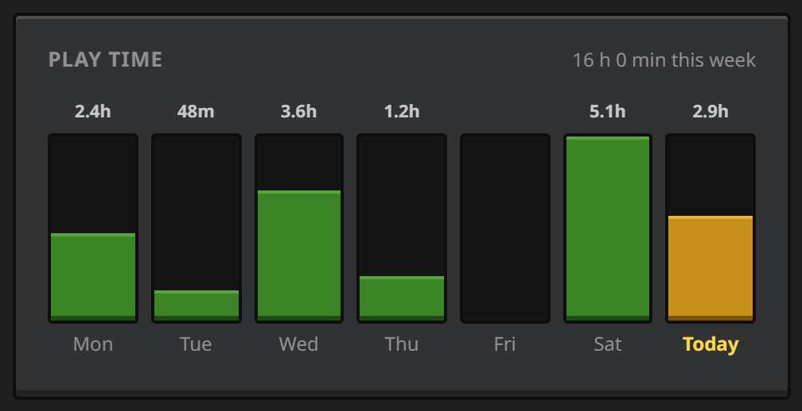

Time in game for each of the last 7 days, counted by the agent in `agent/playtime.json`, so it survives restarts and covers every world and server.

## After you log out

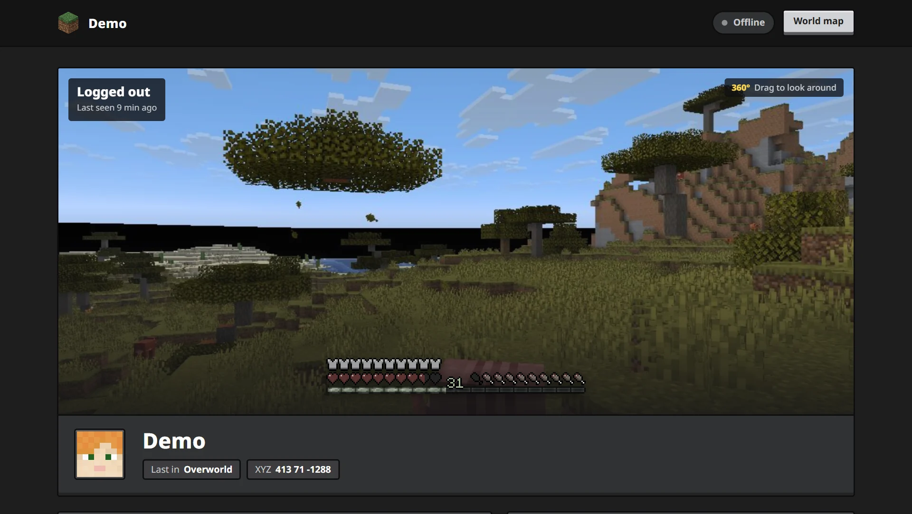

- **360° view:** a panorama of where you left that visitors can drag around (mouse, touch or arrow keys).
  - **Captured** as the pause menu opens in singleplayer, at most every 2 minutes. Save & Quit always goes through that menu, and the game is paused, so the six extra renders happen out of sight.
  - **Six 1024² faces,** using the same camera mode as vanilla's panorama screenshots.
  - **Uploaded** by the agent only after you log out, and only fetched by viewers who see it.
- **Without a panorama** (for example after a crash), the last frame is shown greyed out.
- **The cards** switch to "logged out" versions: what you logged out with, your stats as of that session, and when you were last seen.

## The 3D map

A BlueMap render of the area around your last logout, at `<your site>/map`.

- **Rendered on logout** by the agent: it waits for the save to finish, renders 8 chunks in every direction, and force-pushes the result to the `map` branch as one commit, so the repository never grows.
- **Live markers:** while you play, your marker moves over the page's WebSocket instead of BlueMap's once-a-second polling. Logged out, it marks where you were last seen.
- **Death marker:** where you last died.
- **Styled** to match the status page, with a way back to it.

Turn it on with `map.render_on_logout` in [the agent's config](configuration.md#map). Needs Java 25+ and git push access from your clone. BlueMap downloads textures from your Minecraft client jar, so it also needs `accept_mojang_eula = true`.

## Multiplayer

On someone else's server the page shows that you're playing, your vitals and your inventory. The mod never collects the rest there, and the agent drops it too:

- coordinates and dimension;
- the frame and the panorama;
- world, statistics and advancements;
- map markers and the logout map;
- curses.

The server's address is never written anywhere. For a server you run yourself, see the [server tool](server-tool.md).

## Cursed mode

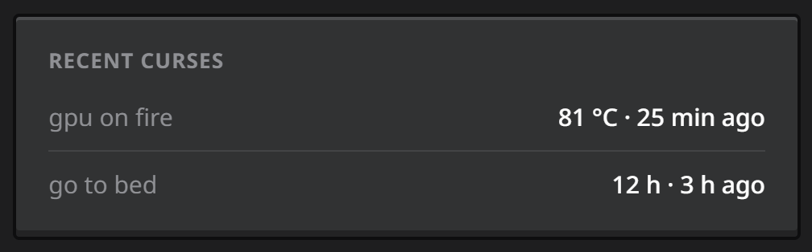

The machine reaches into your world. Rules are conditions on live metrics plus plain Minecraft commands:

```toml
[cursed]
enabled = true

[[cursed.rules]]
name = "gpu on fire"
when = "gpu_temp >= 80"
cooldown_seconds = 120
commands = ['execute at {player} run fill ~-2 ~ ~-2 ~2 ~ ~2 minecraft:fire replace minecraft:air']
```

- **Metrics:** `cpu_percent`, `gpu_percent`, `mem_percent`, `uptime_hours`, `health` (0–20), `foodlevel` (0–20), `xplevel`, and `cpu_temp`, `gpu_temp` with fastfetch.
- **Firing:** when the condition becomes true, then again every `cooldown_seconds` while it stays true. `{player}` becomes your name.
- **Where:** singleplayer worlds (the mod runs the commands, since there's no RCON) and your own RCON server. Never on other servers.
- **Seen on the page:** the curses that fired recently.
- **Test first:** `python agent/agent.py --dry-run` shows the live metrics and which rules would fire. Fire kills: use long cooldowns and try rules on a copy of your world.

The example config ships four rules: GPU on fire, CPU thunderstorm, out-of-RAM slowness, and "go to bed" after 12 hours of uptime.

## Who can watch

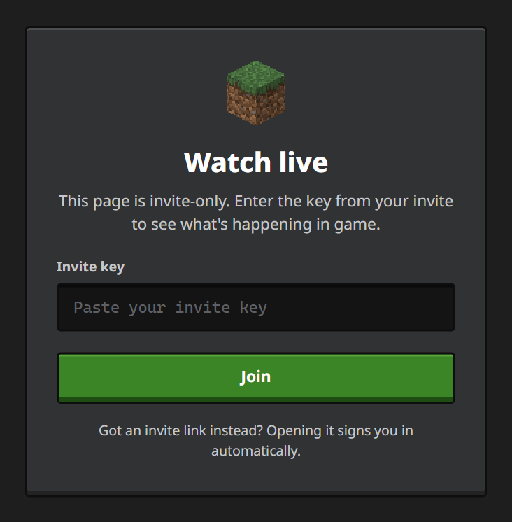

- **Invite key only.** Without it, visitors see this screen and receive no data. Invite links (`<your site>/#key=…`) sign in automatically; the key never reaches GitHub because it's in the URL fragment.
- **At most 10 at once.** The 11th sees "Too many people are watching" with a retry button.
- **Hidden tabs** give their slot back after a minute and reconnect when shown again.
- **Revoking:** `python setup.py invite` makes a new key and disconnects everyone on the old one.
- **Blocked WebSockets:** the page falls back to fetching once a minute.

More in [Privacy and security](privacy.md).

## What shows when

| | Playing in your own world | Playing on someone's server | Logged out |
| --- | :---: | :---: | :---: |
| Frame with vitals | ✓ | | greyed out, if there's no panorama |
| 360° panorama | | | ✓ after a singleplayer session |
| Coordinates | ✓ | | where you were last seen |
| Inventory | ✓ | ✓ | what you logged out with |
| World | ✓ | | |
| Advancements, checklists, statistics | ✓ | | as of your last own-world session |
| The game, play time | ✓ | ✓ | ✓ |
| TPS | ✓ | | |
| Mods | ✓ | ✓ | ✓ |
| Curses | ✓ | | recent ones |

If the agent stops pushing for 90 seconds (PC off, agent closed), the page says so and keeps showing the last state.

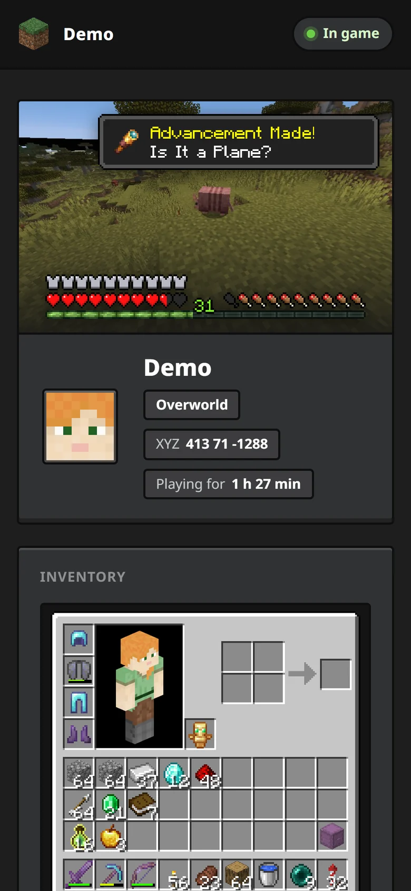

Every card works on a phone. The game GUIs are scaled by whole pixels to the screen, so they stay sharp.
