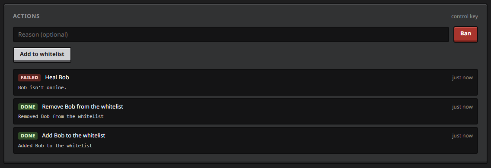
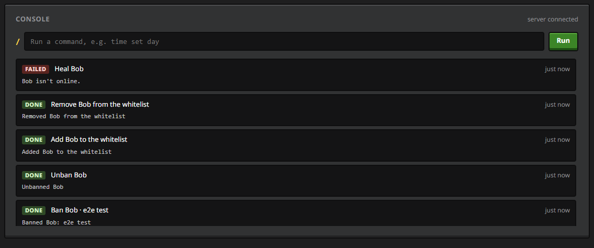

# Server tool

[← README](../README.md) · [Setup](setup.md) · [Features](features.md) · **Server tool** · [Configuration](configuration.md) · [Privacy](privacy.md) · [Architecture](architecture.md) · [Development](development.md)

The same mc-status jar, dropped into a Fabric server, publishes every player on that server to `<your site>/server.html`. For you it's a moderation view; for each player, a page of their own.

It's optional: until you run `python setup.py server`, every server route on your Worker refuses everything. Screenshots show made-up demo data.

- [Who sees what](#who-sees-what)
- [The admin page](#the-admin-page)
- [A player's page](#a-players-page)
- [Actions and the console](#actions-and-the-console)
- [In-game commands](#in-game-commands)
- [Setting it up](#setting-it-up)
- [Settings](#settings)
- [Revoking access](#revoking-access)
- [How keys work](#how-keys-work)
- [Staying free](#staying-free)

## Who sees what

| Opened with | Sees |
| --- | --- |
| **the control key** | everything the admin key sees, plus [actions and the console](#actions-and-the-console) |
| **the admin key** | the server's overview and every player, online and offline, including coordinates; look only |
| **a player link** | only that player's own page |
| **no key or a wrong one** | a key field and nothing else: no server name, no player names, no counts |

The status page doesn't link to `server.html`, and it isn't indexed by search engines. The Worker checks the key before sending anything, and filters what each viewer receives separately, so a player's page never receives another player's data.

## The admin page


- **Server:** players online out of the maximum, TPS, tick time, in-game day and time, weather and version.
- **Players:** everyone who has played on the server. Sort by any column, filter by name.
  - online: health, dimension and coordinates, ping;
  - offline: when they were last seen;
  - everyone: advancement progress.
- **Open a player** for their full page, and **Copy player link** to give them theirs.

## A player's page


- **Identity:** online or last seen, game mode, dimension, coordinates, ping and total play time.
- **Vitals:** armor, hearts, hunger and XP, drawn with the game's sprites.
- **Inventory** on the inventory screen, with tooltips. Only while they're online.
- **Statistics and favourites**, as on the [status page](features.md#statistics).
- **Advancements with checklists:** which biomes, mobs, foods and variants they still need.

Offline players come from the world's saved `players/stats` and `players/advancements` files (read every 5 minutes), named through the server's user cache. Their inventory and position only show while they're online.

Opened through a player link, the page looks the same without the admin buttons.

## Actions and the console

Opened with the **control key**, the admin page can act on the server too.



**On a player's page:**

| Action | When |
| --- | --- |
| Heal, feed | online |
| Game mode | online |
| Send a message (shown in their chat as `[Admin] …`) | online |
| Kick, with an optional reason | online; click twice to confirm |
| Ban, with an optional reason / Unban | always; ban needs a second click |
| Add to / remove from the whitelist | always |



**The console** on the overview runs any server command, as an owner-level source named "Web admin", and shows what the server replied. Arrow up and down go through the commands you ran in this tab.

**The action log** lists the last 50 actions and commands with their result (sent, done or failed) and the server's output. Only control-key viewers see it.

**How an action travels:**
1. The page sends it over its WebSocket.
2. The Worker checks the key, the action and its fields (known actions only, a real player UUID, bounded text, at most 30 actions a minute), and passes it down the server's own connection.
3. The mod checks it again and runs it on the server thread. Kick, ban, unban, whitelist and game mode run as the vanilla commands, so ops in game see the usual `[Web admin: Banned …]` notice, and the server log records every action as `[Web admin] …`.
4. The result comes back up and lands in the log; the next status push shows the effect.

If the server isn't connected, the buttons are replaced by a note and nothing is queued.

## In-game commands

| Command | Who can use it | Sends you |
| --- | --- | --- |
| `/mcstatus link` | every player | a link to your own page |
| `/mcstatus link <player>` | ops, level 2+ | that player's link, to pass on |
| `/mcstatus admin` | ops, level 3+ | a link to the admin page (look only) |
| `/mcstatus control` | ops, level 4 | a link to the admin page with actions and the console |

- **Only the person who asked** sees the link, as a green clickable chat message. Clicking it opens Minecraft's "open this link?" dialog, which also offers to copy it.
- **From the server console,** the link is printed instead.
- **Keys aren't stored on the server.** The server asks the Worker for them with its own token each time.

## Setting it up

You need a Fabric server on the same Minecraft version as the mod, with Fabric API, and the status page already deployed ([Setup](setup.md)).

1. **Create the keys and the config file.** On the PC where you ran the wizard:
   ```bash
   python setup.py server
   ```
   It creates four Worker secrets (`SERVER_PUSH_TOKEN`, `ADMIN_KEY`, `CONTROL_KEY`, `PLAYER_LINK_SECRET`) and writes `server/mc-status-server.properties`. That folder is gitignored, because the file contains the server's token.
2. **Deploy the Worker** if you haven't since updating: `python setup.py deploy`.
3. **Install on the server:** put the mc-status jar in `mods/` and `mc-status-server.properties` in `config/`.
4. **Start the server.** Its log says `publishing <name> to <worker> every 30s`.
5. **Join and run `/mcstatus admin`** (or `/mcstatus control` as a level-4 op). Click the link.

Without the config file, the mod writes an empty one on first start and stays idle.

## Settings

`config/mc-status-server.properties` on the server:

| Setting | Default | What it does |
| --- | --- | --- |
| `worker_url` | | your Worker, e.g. `https://status-api.example.com` |
| `push_token` | | the `SERVER_PUSH_TOKEN` secret; `setup.py server` fills it in |
| `site_url` | | the server page, e.g. `https://example.com/server.html`, for `/mcstatus` links |
| `server_name` | `Minecraft server` | shown at the top of the admin page |
| `interval_seconds` | `30` | seconds between pushes, at least 10 |
| `share_item_names` | `false` | publish custom item names, which can contain anything players type |

## Revoking access

- **Everyone:** run `python setup.py server` again. It replaces all four secrets. Every open control, admin and player page is disconnected at the next push, all old links stop working, and the server needs the new config file.
- **Nobody else can mint links.** Player links can't create other links, the admin key can only make player links, and the agent's `PUSH_TOKEN` can't do either.

## How keys work

- **The control and admin keys** are separate Worker secrets, compared in constant time. The control key is the only one that can act; hand out the admin key for looking.
- **Player links** are `<uuid>.<signature>`, where the signature is an HMAC-SHA256 of the player's UUID with `PLAYER_LINK_SECRET`. The Worker checks a link by recomputing it, so no table of links is stored anywhere, and a link only ever opens its own UUID.
- **The server's token** (`SERVER_PUSH_TOKEN`) is separate from your agent's `PUSH_TOKEN`. Whoever runs or hosts the server can't overwrite your own status, and your agent's token can't get admin links.
- **The server connects out.** It opens one WebSocket to `/server/connect` with its token and keeps it open; status goes up it and actions come down. No port is opened on the server, and a client can't pose as the server: the Worker decides what each socket is, ignoring anything the client claims.
- **Changing a secret** closes every WebSocket that was opened before, with the "key changed" code, so a removed viewer doesn't keep watching.

## Staying free

The Worker stores each player as its own row and only rewrites rows that changed. The server's overview row is written at most once a minute; viewers still get every push live.

| Players online all day | Storage writes per day | Free limit |
| --- | --- | --- |
| 1 | about 4,000 | 100,000 |
| 5 | about 16,000 | 100,000 |
| 20 | about 60,000 | 100,000 |

Status goes over the server's WebSocket, where Cloudflare counts 20 incoming messages as one request: about 150 requests a day at the default 30 seconds, next to the free 100,000. If the socket is down, the mod falls back to one HTTPS request per push. Each action adds two log writes. Raise `interval_seconds` for a busy server; these limits are shared with your own status page.
