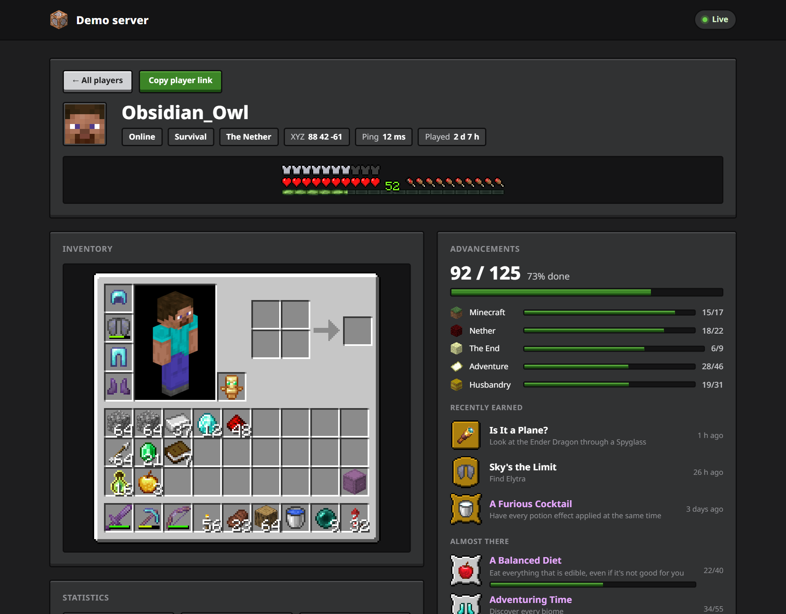

# Server tool

[← README](../README.md) · [Setup](setup.md) · [Features](features.md) · **Server tool** · [Configuration](configuration.md) · [Privacy](privacy.md) · [Architecture](architecture.md) · [Development](development.md)

The same mc-status jar, dropped into a Fabric server, publishes every player on that server to `<your site>/server.html`. For you it's a moderation view; for each player, a page of their own.

It's optional: until you run `python setup.py server`, every server route on your Worker refuses everything. Screenshots show made-up demo data.

- [Who sees what](#who-sees-what)
- [The admin page](#the-admin-page)
- [A player's page](#a-players-page)
- [In-game commands](#in-game-commands)
- [Setting it up](#setting-it-up)
- [Settings](#settings)
- [Revoking access](#revoking-access)
- [How keys work](#how-keys-work)
- [Staying free](#staying-free)

## Who sees what

| Opened with | Sees |
| --- | --- |
| **the admin key** | the server's overview and every player, online and offline, including coordinates |
| **a player link** | only that player's own page |
| **no key or a wrong one** | a key field and nothing else: no server name, no player names, no counts |

The status page doesn't link to `server.html`, and it isn't indexed by search engines. The Worker checks the key before sending anything, and filters what each viewer receives separately, so a player's page never receives another player's data.

## The admin page


- **Server:** players online out of the maximum, TPS, tick time, in-game day and time, weather and version.
- **Players:** everyone who has played on the server. Sort by any column, filter by name.
  - online: health, dimension and coordinates, ping;
  - offline: when they were last seen;
  - everyone: advancement progress.
- **Open a player** for their full page, and **Copy player link** to give them theirs.

## A player's page



- **Identity:** online or last seen, game mode, dimension, coordinates, ping and total play time.
- **Vitals:** armor, hearts, hunger and XP, drawn with the game's sprites.
- **Inventory** on the inventory screen, with tooltips. Only while they're online.
- **Statistics and favourites**, as on the [status page](features.md#statistics).
- **Advancements with checklists:** which biomes, mobs, foods and variants they still need.

Offline players come from the world's saved `players/stats` and `players/advancements` files (read every 5 minutes), named through the server's user cache. Their inventory and position only show while they're online.

Opened through a player link, the page looks the same without the admin buttons.

## In-game commands

| Command | Who can use it | Sends you |
| --- | --- | --- |
| `/mcstatus link` | every player | a link to your own page |
| `/mcstatus link <player>` | ops, level 2+ | that player's link, to pass on |
| `/mcstatus admin` | ops, level 3+ | a link to the admin page |

- **Only the person who asked** sees the link, as a green clickable chat message. Clicking it opens Minecraft's "open this link?" dialog, which also offers to copy it.
- **From the server console,** the link is printed instead.
- **Keys aren't stored on the server.** The server asks the Worker for them with its own token each time.

## Setting it up

You need a Fabric server on the same Minecraft version as the mod, with Fabric API, and the status page already deployed ([Setup](setup.md)).

1. **Create the keys and the config file.** On the PC where you ran the wizard:
   ```bash
   python setup.py server
   ```
   It creates three Worker secrets (`SERVER_PUSH_TOKEN`, `ADMIN_KEY`, `PLAYER_LINK_SECRET`) and writes `server/mc-status-server.properties`. That folder is gitignored, because the file contains the server's token.
2. **Deploy the Worker** if you haven't since updating: `python setup.py deploy`.
3. **Install on the server:** put the mc-status jar in `mods/` and `mc-status-server.properties` in `config/`.
4. **Start the server.** Its log says `publishing <name> to <worker> every 30s`.
5. **Join and run `/mcstatus admin`.** Click the link.

Without the config file, the mod writes an empty one on first start and stays idle.

## Settings

`config/mc-status-server.properties` on the server:

| Setting | Default | What it does |
| --- | --- | --- |
| `worker_url` | | your Worker, e.g. `https://status-api.example.com` |
| `push_token` | | the `SERVER_PUSH_TOKEN` secret; `setup.py server` fills it in |
| `site_url` | | the server page, e.g. `https://example.com/server.html`, for `/mcstatus` links |
| `server_name` | `Minecraft server` | shown at the top of the admin page |
| `interval_seconds` | `30` | seconds between pushes, at least 10 |
| `share_item_names` | `false` | publish custom item names, which can contain anything players type |

## Revoking access

- **Everyone:** run `python setup.py server` again. It replaces all three secrets. Every open admin and player page is disconnected, all old links stop working, and the server needs the new config file.
- **Nobody else can mint links.** Player links can't create other links, and the agent's `PUSH_TOKEN` can't either.

## How keys work

- **The admin key** is a Worker secret, compared in constant time.
- **Player links** are `<uuid>.<signature>`, where the signature is an HMAC-SHA256 of the player's UUID with `PLAYER_LINK_SECRET`. The Worker checks a link by recomputing it, so no table of links is stored anywhere, and a link only ever opens its own UUID.
- **The server's token** (`SERVER_PUSH_TOKEN`) is separate from your agent's `PUSH_TOKEN`. Whoever runs or hosts the server can't overwrite your own status, and your agent's token can't get admin links.
- **Changing a secret** closes every WebSocket that was opened before, with the "key changed" code, so a removed viewer doesn't keep watching.

## Staying free

The Worker stores each player as its own row and only rewrites rows that changed. The server's overview row is written at most once a minute; viewers still get every push live.

| Players online all day | Storage writes per day | Free limit |
| --- | --- | --- |
| 1 | about 4,000 | 100,000 |
| 5 | about 16,000 | 100,000 |
| 20 | about 60,000 | 100,000 |

Pushes are one request each: 2,880 a day at the default 30 seconds, next to the free 100,000. Raise `interval_seconds` for a busy server. These limits are shared with your own status page.
